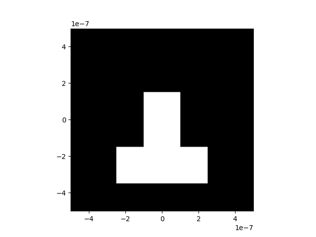
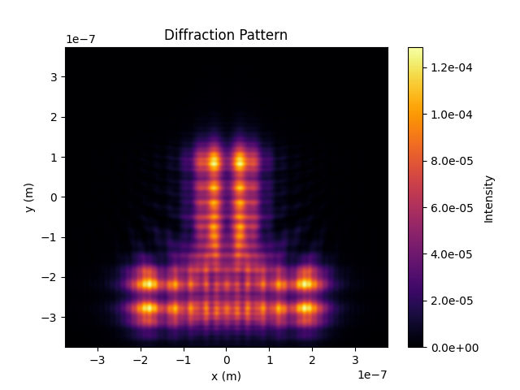
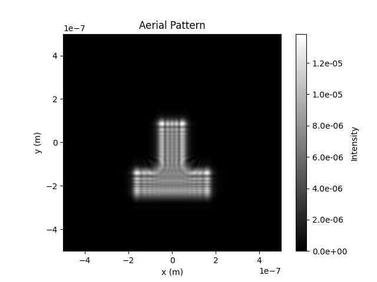

## Aerial Image Formation with Fast Fourier Transform(FFT)

This repository contains code for aerial image formation using Fast Fourier Transform (FFT). The code is implemented in Python and utilizes libraries such as NumPy and Matplotlib for processing and visualization. This project is inspired from the personal website: 

https://rafael-fuente.github.io/solving-the-diffraction-integral-with-the-fast-fourier-transform-fft-and-python.html. The aerial image is computed by the inverse fourier transform of the diffraction pattern of the mask.

 

