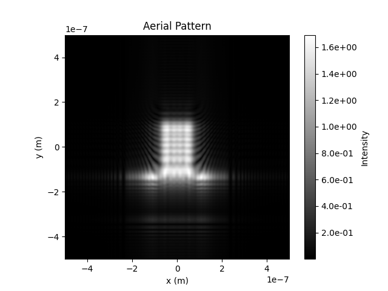

## Aerial Image Formation with Fast Fourier Transform(FFT)

This repository contains code for aerial image formation using Fast Fourier Transform (FFT). The code is implemented in Python and utilizes libraries such as NumPy and Matplotlib for processing and visualization.

